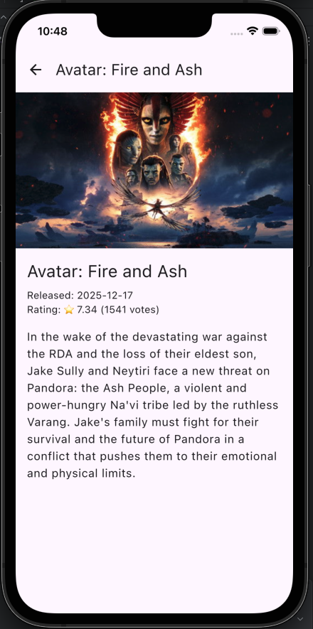

🎬 CineFlow KMP
===============


**CineFlow** is a high-performance movie discovery application built with **Kotlin Multiplatform (KMP)**. It demonstrates how to share 100% of business logic and 90%+ of UI code between Android and iOS without sacrificing native performance.

> **"Stop building bridges. Start building native."** > This project serves as a proof-of-concept for modern mobile development, utilizing a Single Source of Truth (SSOT) architecture, offline-first caching, and Declarative UI.


📱 Screenshots
--------------
|                             Home                              |                             Detail                             |
|:-------------------------------------------------------------:|:--------------------------------------------------------------:|
|  |  |


🚀 Tech Stack
-------------

*   **Core:** Kotlin Multiplatform (KMP)

*   **UI Framework:** Compose Multiplatform (Material 3)

*   **Architecture:** Clean Architecture + MVVM

*   **Networking:** Ktor 3.0 (ContentNegotiation, Logging, CIO Engine)

*   **Database:** Room KMP (SQLite Driver for native persistence)

*   **Dependency Injection:** Koin 4.0

*   **Image Loading:** Coil 3.0 (Async image loading with caching)

*   **Concurrency:** Coroutines & Flow

*   **Navigation:** Jetbrains Navigation Compose


✨ Key Features
--------------

*   **Cross-Platform UI:** A single Compose codebase rendering native UI on both Android and iOS.

*   **Real-time Discovery:** Fetches "Now Playing," "Popular," and "Top Rated" movies via TMDB API.

*   **Offline-First:** Robust caching strategy using Room. App remains fully functional without internet.

*   **Search Implementation:** Optimized local search through cached data.

*   **Reactive State Management:** Uses StateFlow and collectAsStateWithLifecycle for lifecycle-aware UI updates.

*   **Adaptive Theming:** Fully supports Dark/Light mode based on system settings.


🏗️ Architecture
----------------

The project follows a strict **Clean Architecture** pattern to ensure separation of concerns and testability.

```
commonMain
├── domain          # Pure Kotlin (No Frameworks)
│   ├── models      # Data classes
│   ├── repository  # Interfaces
│   └── usecases    # Business Logic
├── data            # Framework Implementation
│   ├── local       # Room Entities & DAO
│   ├── remote      # Ktor DTOs & Service
│   └── repository  # Repository Implementation
└── presentation    # UI & State
    ├── components  # Shared Composables
    ├── screens     # Feature Screens
    └── viewmodel   # State Holders

```
🛠️ Setup & Configuration
-------------------------

### Prerequisites

-   **Android Studio:** Ladybug (or newer)

-   **Xcode:** 15+ (Required for iOS target)

-   **JDK:** 17 or 21

-   **TMDB API Key:** [Get it here](https://www.themoviedb.org/documentation/api "null")

### Installation

1.  **Clone the repository:**

    ```
    git clone [https://github.com/ShuhamDebnath/CineFlow-KMP.git](https://github.com/ShuhamDebnath/CineFlow-KMP.git)
    cd CineFlow-KMP

    ```

2.  **Secure API Key Setup:** This project uses `local.properties` to secure API keys.

    -   Open (or create) the `local.properties` file in the root directory.

    -   Add your key:

        ```
        TMDB_API_KEY=your_actual_api_key_here

        ```

3.  **Run the App:**

    -   **Android:** Select `composeApp` configuration and run on an Emulator/Device.

    -   **iOS:** Open `iosApp/iosApp.xcodeproj` in Xcode OR run directly via the KMP plugin in Android Studio.


🛠️ Setup & Configuration
-------------------------

Built by **Shuham Debnath** — Android Developer & KMP Enthusiast.

_Licensed under MIT._
